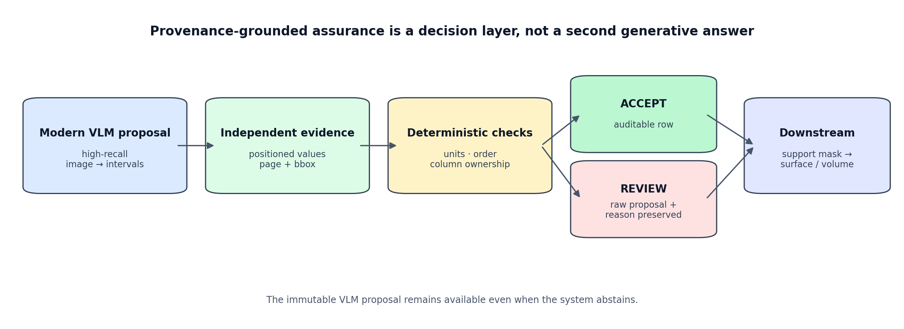
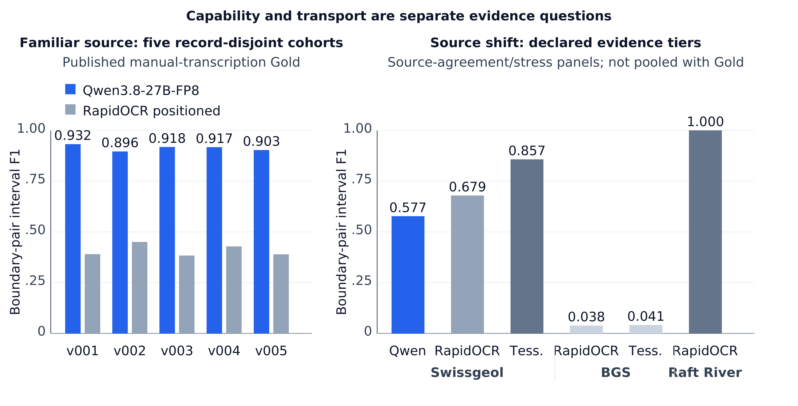
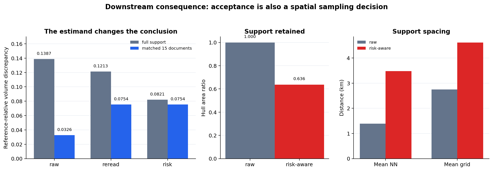

# Trustworthy Borehole Database Ingestion from VLM Proposals: Provenance and Spatial Support

## Abstract

**Background:** High visual extraction accuracy does not by itself establish a trustworthy geological database. A database row also needs independently checkable page evidence, a decision state, and an account of what abstention removes from downstream spatial support. **Methods:** We evaluate the frozen `Qwen/Qwen3.8-27B-FP8` direct page-to-JSON reader on five record-disjoint California cohorts (450 reports; 8,268 published manual-transcription intervals) and source-shift panels. The headline metric is boundary-pair interval F1: both interval depths must match under an order-preserving tolerance. We then add an independently positioned reader, deterministic depth/column checks, and an accept-or-review policy; a separate legacy sequence-reconstruction analysis is reported only as a harm analysis. **Results:** Qwen reaches boundary-pair F1 0.896–0.932 on California, but falls to 0.577 on the Swissgeol source-agreement panel. On held-out California v003, independent evidence yields selective precision 0.993 (444/447 accepted intervals correct) at 0.244 proposal coverage. Only 4/100 documents satisfy complete-document auto-acceptance, which defines a conservative deployment boundary rather than a claim of full automation. A spatial diagnostic shows that full-support risk-aware volume discrepancy is 0.0821 versus 0.1387 for raw extraction, while retaining only 0.636 of the reference convex-hull area; on the identical 15-document accepted subset, risk and rereading are both 0.0754 versus 0.0326 for raw. **Conclusions:** Modern VLMs are strong proposal readers, not database authorities. Provenance-grounded selective decisions must report precision together with coverage, complete-document utility, review burden, and the spatial-support consequences of abstention.

**Keywords:** borehole logs; vision-language models; provenance; selective prediction; spatial support; geoscience computing

## Highlights

- Qwen3.8-27B-FP8 reaches 0.896–0.932 boundary-pair F1 on 450 reports.
- Independent positioned evidence reaches 0.993 precision at 24.4% proposal coverage.
- Only 4% of held-out documents qualify for complete automatic acceptance.
- Abstention changes spatial support and can reverse an apparent volume improvement.

## 1. Problem, hypothesis, and research questions

Digitizing historical borehole logs is often described as an OCR problem. That description is operationally incomplete. A typical log combines a depth scale, cumulative boundary or thickness columns, sampling marks, lithology symbols, free-text descriptions, water-level annotations, and report metadata. The same number may be a top boundary, a bottom boundary, a sample depth, or a scale tick depending on its column and vertical context. A parser can therefore achieve a favourable character or interval score while creating an unusable geological record.

The central problem addressed here is the gap between visual extraction and trustworthy database acceptance. A trustworthy record must satisfy four conditions. First, the predicted interval sequence must be numerically coherent and sufficiently complete. Second, each critical value must retain provenance to a source page and region. Third, the system must distinguish a plausible proposal from an automatically acceptable update. Fourth, abstention must be assessed as a change in downstream support rather than treated as a harmless missing value.

Modern VLMs make the first condition substantially easier on familiar page families. They can associate typography, lines, symbols, and prose without a separate OCR transcript. That capability changes, rather than eliminates, the scientific question. If a direct VLM produces high boundary-pair F1 but the tested interface does not provide independently verifiable field provenance, a calibrated acceptance state, or an independent column-ownership witness, a database curator cannot tell which rows are safe to ingest. Conversely, a conservative system may reduce false corrections by rejecting difficult pages while deleting the spatial observations needed for a surface or volume diagnostic. We therefore evaluate extraction, assurance, and downstream consequence as one chain.

This paper tests one central hypothesis: high extraction capability becomes
trustworthy database ingestion only when each automatically admitted interval
has independently checkable provenance and deterministic structural checks,
and when abstention is evaluated as a change in downstream spatial support.
The hypothesis links capability, evidence, decision, and geoscientific
consequence rather than treating them as separate benchmarks.

We retain exactly three research questions:

**RQ1 — Extraction reliability under cohort and source shift.** How stable are boundary-pair interval predictions and complete boundary sequences across independent cohorts from the same publication program and across unrelated source families?

**RQ2 — Provenance-grounded selective assurance.** Can independent positioned evidence, field semantics, deterministic depth geometry, and structural sequence constraints convert high-recall VLM proposals into auditable selective decisions with low critical error and explicit abstention?

**RQ3 — Downstream consequence of extraction error and abstention.** How do value errors, missing or altered ordered boundaries, and risk-driven support deletion propagate to spatial support, interpolated surfaces, and volume diagnostics?

The contributions correspond directly to the three questions:

1. **Capability and transport.** A multi-cohort and source-shift evaluation
   shows that modern VLM boundary extraction can be strong on a familiar
   borehole-log family while remaining insufficient for transportable,
   database-level assurance.
2. **Provenance-grounded selective assurance.** A VLM is treated as a
   proposal reader; independently positioned evidence and deterministic
   structural checks control which proposals can be automatically accepted.
   The legacy recovery analysis is a supporting harm experiment, not a
   separate method claim.
3. **Downstream support-aware evaluation.** Full-support and matched-support
   diagnostics show that abstention changes the geoscientific observation set
   and can change apparent downstream error. Reproducibility records provide
   the infrastructure for these claims rather than a fourth contribution.

## 2. Related work and positioning

### 2.1 Borehole-log extraction and document intelligence

Document intelligence separates recognition, layout, table topology, and
visual-language reasoning rather than treating them as one OCR capability
[@smith2007tesseract; @xu2020layoutlm; @pfitzmann2022doclaynet;
@smock2022pubtables; @kim2022donut; @hu2024docowl2]. Borehole studies report
image-based extraction [@zhang2020boreholeimages], OCR-assisted classification
and database construction [@han2024boreholeocr], PDF workflow evaluation
[@amini2023boreholepdf], historical well-record extraction with a large
language model [@ma2024historicalwell], and VLM-based structured generation
[@shiga2026boreholevlm]. These studies establish what a page reader can
recover, but their targets and source families differ; extraction quality is
therefore not automatically a database admission decision.

### 2.2 Selective prediction, provenance, and trustworthy ingestion

The reject option has a long statistical history: a classifier may reduce
error by declining cases whose expected cost is too high [@chow1970reject].
Modern selective-classification work formalizes coverage and selective risk
[@geifman2017selective; @geifman2019selectivenet], while a recent survey
organizes reject-option design and evaluation across machine-learning settings
[@hendrickx2024reject]. Conformal risk control provides a related way to
state finite-sample risk targets, although the present protocol is a fixed
evidence gate rather than a conformal procedure [@angelopoulos2024crc].
Human-in-the-loop systems emphasize preserving the hand-off between model
proposal and human decision [@amershi2014interactive]. Database provenance
formalizes why a value exists and which source derivation supports it
[@buneman2001provenance; @simmhan2005provenance]. Together these works explain
why prediction accuracy and acceptance authority are different objects.

### 2.3 Geoscientific uncertainty and spatial support

Geoscientific studies show that borehole interpretation and geological
interfaces inherit uncertainty from observations and modelling choices
[@lark2014crosssection; @pakyuzcharrier2018drillhole;
@wellmann2018uncertainty; @wang2023interfaceuncertainty]. Lithology
vocabularies and automated stratigraphic metrics help compare structured
interpretations, but they presuppose that intervals have already been
recovered and semantically assigned [@mccormick2023lithology;
@fuentes2020lithologicalmapping; @garzon2026stratigraphicmetrics].
Recent density studies further show that changing borehole support can alter
geostatistical and three-dimensional model behaviour
[@tran2025boreholedensity; @zhang2026boreholedensity].

\begingroup
\scriptsize

| Representative study | Domain/source | OCR/VLM | Cross-source | Provenance | Selective gate | Complete document | Spatial support |
|---|---|---|---|---|---|---|---|
| Zhang et al. (2020) | Borehole-log images | OCR/deep model | Not reported | Not reported | Not reported | Not reported | Not reported |
| Han and Suh (2024) | Abandoned-mine logs | OCR/deep model | Not reported | Page extraction, not field trace | Not reported | Structured target, not admission | Not reported |
| Amini et al. (2023) | Government PDF logs | OCR/PDF workflow | Multiple PDF sources | PDF selection and capture | Not reported | Not reported | Not reported |
| Ma et al. (2024) | Historical well records | Large language model | Not reported | Record extraction, not bbox gate | Not reported | Not reported | Not reported |
| Geifman and El-Yaniv (2017) | General classification | Neural classifier | Not applicable | Model confidence | Reject option | Coverage/risk, not documents | Not reported |
| Hendrickx et al. (2024) | Reject-option survey | Multiple ML settings | Review of settings | Not a source-provenance workflow | Selective risk | Not document completeness | Not reported |
| Buneman et al. (2001) | Database provenance | Not an extraction model | Not applicable | Provenance semantics | Not an acceptance experiment | Not reported | Not reported |
| Lark et al. (2014) | Geological cross-sections | Geoscientific modelling | Borehole uncertainty | Input uncertainty | Not an extraction gate | Not reported | Support/model uncertainty |
| This study | Borehole pages to database | VLM + positioned evidence | California cohorts + shift | Page-local bboxes | Fixed ACCEPT/NEEDS_REVIEW | 4/100 documents | Full/matched |

Table: Representative-work comparison across extraction capability, provenance, selective admission, document-level utility, and downstream spatial support. "Not reported" means that the cited study did not report that evaluation dimension; it does not imply a methodological deficiency for the study's stated objective. {#tab:related-work}

\endgroup

Existing studies establish extraction capability, selective-risk principles,
and downstream geoscientific uncertainty largely as separate problems. This
study connects them at the document-to-database decision boundary. Extraction
studies mainly ask whether a page can be parsed; selective prediction asks when
a model should abstain; geoscientific uncertainty studies ask how imperfect
observations affect downstream models. The present question is when a
visually plausible borehole extraction can be admitted to a geological
database, and what observational support is lost when it is not admitted.

## 3. Evidence, data, and task definition

### 3.1 Evidence tiers

The evaluation separates evidence types before any metric is calculated.

| Evidence type | Meaning | Claims supported here |
|---|---|---|
| Published manual-transcription Gold | External institution transcribed source images and applied reported QC | Formal boundary-pair and semantic extraction accuracy within that release |
| Source-agreement reference | An explicit page table agrees with an authoritative database sequence | Source-specific transfer and downstream consistency, not representative human image GT |
| Authoritative metadata | Official IDs, coordinates, collars, or final-depth fields | Field agreement and spatial-support diagnostics |
| Machine Silver | Multiple machines or deterministic rules construct a reference | Agreement and development analysis only |
| Audit/no reference | No independent target | Coverage, runtime, schema validity, and failure mechanisms |

Table: Evidence tiers and the claims each tier supports in this study. Evidence tiers are kept separate rather than pooled into a single accuracy estimate. {#tab:evidence-tiers}

Synthetic records are a separate controlled class with programmatically known labels. Evidence tiers are never pooled into a single accuracy estimate. In particular, source-agreement panels are not described as newly annotated human Gold, and synthetic dual-reader experiments are not described as two observed readers.

### 3.2 Primary California cohorts

The primary accuracy evidence is the USGS California lithology release and its paired public report links [@haugen2025californialithology; @borkovich2025californiawcr]. The publisher's metadata describes manual transcription from well-completion-report images, preservation of reported wording, and checks for sequencing, gaps, and final-depth completeness. The project formed mutually record-disjoint freezes v001–v005. The formal evaluation contains 450 reports and 8,268 intervals: v001 contributes 50 test reports and 697 intervals, while v002–v005 contribute 100 reports each and 1,770, 1,788, 1,944, and 2,069 intervals.

The selection flow begins with 12,732 deterministically paired reports and 225,150 exact-deduplicated intervals. Filters retain reports with 5–60 intervals, empty source comments, and adjacent continuity at least 0.99. County-diverse acquisition and record-disjoint freezing define the five cohorts. The resulting data are useful for independent replication but are not a random sample of every California log; the moderate interval-count and continuity filters are reported as part of the estimand.

### 3.3 Source-shift panels

The Swissgeol Thurgau held-out panel contains 35 source-agreement documents and 80 explicit top/bottom intervals. It is selected from pages whose published table agrees with the official database and is therefore a transfer panel rather than a national Gold benchmark. BGS Offshore contains 26 historical source groups and 341 graphic-log intervals joined from official survey, scan, and geology layers. Raft River contributes two reports with 62 explicit interval rows. These panels stress different page lengths, typography, scan quality, and column semantics. A one-time unseen BGS source-family run is reserved for the external risk gate and never used for tuning.

### 3.4 Structured spatial support

The downstream analysis uses the 35 Swissgeol documents and their authoritative coordinates/collars after extraction decisions are frozen. The 35 documents contain 80 ordered boundaries with sparse support at depth. A separate controlled support-preservation protocol is retained in Supplementary Methods S5; it is not part of the image-extraction benchmark and does not provide an observed second reader.

### 3.5 Task output and headline metric

The output schema stores borehole metadata, ordered intervals, raw and normalized terminology, page and bbox provenance, extraction method, confidence, validation state, and warnings. The headline interval metric is **boundary-pair interval F1**. Given reference intervals (G) and predictions (P), a prediction matches only when both top and bottom depths fall within the inclusive tolerance after unit conversion, under order-preserving maximum-cardinality matching with minimum total error as the tie-break. A single correct top boundary or a syntactically valid JSON object is not an interval match.

Boundary-exact rate requires the complete ordered boundary sequence for a document. Full-record exact additionally requires the evaluated semantic fields to agree. Matched lithology exact is reported when the reference and output contain comparable lithology fields. The direct Qwen evaluation schema and archived metrics do not include a validated lithology/full-record adjudication for every proposal; we therefore report boundary-pair F1 and boundary-exact for that model and explicitly mark semantic/full-record correctness as unavailable rather than infer it from JSON validity. The positioned OCR baselines provide matched-lithology and full-record exactness as a complementary lower-level diagnostic.

## 4. Methods: provenance-grounded selective assurance

### 4.1 Modern VLM proposal reader

The open modern baseline is the official `Qwen/Qwen3.8-27B-FP8`
checkpoint [@qwen2026qwen38]. The weights use fine-grained dynamic FP8 E4M3
and were served with vLLM over four RTX 2080 Ti GPUs. The serving process is
**partially reconstructable**: its source commit, per-request logs, and
immutable contemporaneous runtime lockfile were not recoverable. The full
component hashes, local revision, runtime versions, and unrecoverable fields
are retained in Supplementary Table S4; this main-text summary identifies the
evaluated object without interrupting the scientific narrative.

Pages are rendered at 200 DPI with PyMuPDF to lossless PNG, without crop, rotation, or enhancement. The prompt is `vlm_interval_source_units_v002`, SHA-256 `891bc6beb7ff9cf35c55389191a208c9b09e9e2dc76909f716603f413745104a`. Decoding uses temperature 0, provider-default top-p, thinking disabled, a 4,096-token maximum, zero automatic retries, and strict JSON parsing. No repair, reordering, deduplication, or reference-conditioned completion is performed. Non-finite or non-positive ranges are rejected during deterministic source-unit conversion. This protocol was frozen before each cohort result.

The VLM returns interval proposals (V=(v_1,ldots,v_n)). It is intentionally treated as a reader that proposes visible structure, not as an authority that can directly write a database. This separation allows the paper to evaluate the value of modern visual semantics without granting the model unobserved provenance or acceptance authority.

### 4.2 Independent positioned evidence

An independently frozen RapidOCR positioned parser produces candidates (C=(c_1,ldots,c_m)). Each candidate retains page index, normalized top and bottom column positions, y-order, OCR confidence, geological-term evidence, source text, and the original region bbox. The VLM and positioned parser do not exchange outputs. A proposal and positioned candidate are eligible for evidence agreement only when their top and bottom depths agree under a strict source-unit tolerance and the candidate retains both source regions.

The numeric anchor is weaker than semantic ownership: finding the same number somewhere on a page does not prove that it is the interval boundary. Automatic acceptance therefore requires complete top-bottom interval agreement, monotone order, non-overlap, positive thickness, and retained bboxes. Partial agreement is recorded as a proposal for review, not as a complete accepted interval.

### 4.3 Deterministic geometry and evidence gate

The positioned reader supplies candidates with source-unit top and bottom depths, page order, normalized column coordinates, OCR confidence, geological-term evidence, source text, and both original region bboxes. Deterministic checks convert these fields into an evidence state: finite and positive depths, compatible units, top < bottom, non-overlap, monotone page/depth order, and agreement of both endpoints with the same positioned semantic column. A matched number without semantic ownership remains `LOCATED`, not `ACCEPTED`.

The main assurance path is therefore a four-stage decision, shown in Fig. 1: (i) the VLM proposes visible intervals; (ii) the independently positioned reader supplies page-local evidence; (iii) deterministic geometry checks test endpoint, unit, order, and ownership conditions; and (iv) the system returns `ACCEPT` or `NEEDS_REVIEW` while preserving the immutable proposal and its provenance. The direct VLM interface used here did not provide independently verifiable field provenance; the assurance layer adds that missing evidence rather than assuming that JSON validity supplies it.

### 4.4 Selective accept/review policy

The policy accepts a proposal only when both endpoints agree with an independently positioned interval, both source bboxes are retained, the interval is non-overlapping and monotone, and no critical numerical or unit check fails. Partial agreement is recorded as a proposal for review. The protocol was frozen after California v001 development: the agreement and field-evidence tolerances are fixed at \(10^{-6}\) in their respective units, v002 is validation, and v003 is the reported held-out replication. Although v004 and v005 are held-out direct-reader cohorts in the broader protocol, no VLM assurance confirmation run is claimed for them here. The document is the primary risk unit because actions cluster within reports; action-level false-correction rates are secondary.

The policy reports three different quantities rather than one automation score: proposal coverage (accepted intervals divided by VLM proposals), selective precision among accepted intervals, and complete-document automation (documents for which the full ordered record passes the acceptance gate). On held-out v003, complete-document auto-acceptance is 4/100 (4%). This is the intended conservative deployment boundary: it identifies a small set that can enter a database automatically and sends the remaining proposals to review, rather than treating partial acceptance as complete-record correctness. For \(n\) accepted documents and zero observed worsened documents, the one-sided 95% upper bound is \(1 - 0.05^{1/n}\); this finite-sample statement is not a safety certification.

### 4.5 Secondary legacy sequence-reconstruction and harm analysis

The positioned candidate pool also supports a separate, legacy sequence-reconstruction analysis. It is not the executed end-to-end VLM assurance path. Its purpose is diagnostic: quantify how monotonic path selection, continuity, column stability, and semantic scores change recall and false corrections when proposals are reconstructed without the independent VLM-evidence gate. The full candidate representation, dynamic-programming objective, threshold grid, and same-pool ablation are specified in Supplementary Methods S2. This separation prevents a recovery-oriented decoder from being mistaken for the conservative acceptance policy.

### 4.6 Spatial consequence protocol

For boundary (r) in borehole (i), elevation is (z_{ir}=c_i-d_{ir}), where (c_i) is collar elevation and (d_{ir}) is depth. IDW at query location (u) is

\[
\hat z_r(u)=\frac{\sum_{i\in N(u)}\lVert u-u_i\rVert^{-p}z_{ir}}{\sum_{i\in N(u)}\lVert u-u_i\rVert^{-p}}.
\]

Thickness is the difference between adjacent surfaces. For a hull-clipped grid (G), the volume diagnostic is (\hat V_\ell=A|G|^{-1}\sum_{u\in G}\hat h_\ell(u)), and the aggregate reference-relative volume discrepancy is

\[
\frac{\sum_\ell|\hat V_\ell-V_\ell|}{\sum_\ell|V_\ell|}.
\]

We report two estimands. Full-support comparison lets each extraction policy use its own available points; it measures the deployed package, including selection. Matched-subset comparison restricts raw, reread, and risk-aware inputs to the same 15 accepted documents; it measures value/sequence differences conditional on acceptance. If risk and reread are identical on this subset, any full-support difference is selection and support, not an additional correction. Spatial diagnostics include point coverage, convex-hull area ratio, nearest-neighbour distance, grid-to-nearest-observation distance, IDW power/neighbour/grid sensitivity, leave-one-borehole-out error, and volume jackknife. Abstention is treated as a **spatial sampling operator**: it changes the set of observations available to the downstream diagnostic, not merely the values attached to fixed locations.

## 5. Experimental protocol and reproducibility

All California cohorts are project- and record-disjoint. The direct Qwen protocol is fixed before evaluation, and no Gold error case changes prompt, decoder, matcher, threshold, or model roster. Source-shift panels are scored with their declared evidence tier. Swissgeol development and held-out roles are separated by salted PDF-content groups. The BGS v003 external run is opened once after the development gate and its result is not used for tuning.

The evaluation protocol and deterministic post-processing components are
reproducible given the frozen page renders, candidate pools, configuration
files, and seeds; bitwise deterministic VLM execution is not claimed.
Document-cluster bootstrap resamples whole reports. Public release metadata
records source URLs, exact manifests, hashes, evidence tiers, and archive
checksums. The article package releases structured/reanalysis assets, manifests,
hashes, source URLs, and recomputation materials. The separately versioned
`data-v002` companion contains the selected source files and structured datasets
that passed the author's item-level rights, attribution, linkage, privacy,
sensitive-location, and embedded-content review. Model weights and private
credentials are not redistributed.

## 6. Results

### 6.1 Capability is high on familiar sources but does not transport uniformly

On the five California cohorts, Qwen3.8-27B-FP8 obtains boundary-pair interval F1 of 0.932, 0.896, 0.918, 0.917, and 0.903. Its document-cluster 95% intervals are [0.888, 0.973], [0.841, 0.943], [0.878, 0.953], [0.876, 0.952], and [0.864, 0.939]. Complete boundary sequences occur in 74%, 70%, 72%, 74%, and 69% of documents. Zero-output rates are 0, 0, 0, 0.05, and 0.01. The corresponding frozen RapidOCR parser obtains 0.390, 0.450, 0.383, 0.428, and 0.389, with zero-output rates of 0.08–0.23 and full-record exactness of 0–2% in the available evaluated fields. The paired document-cluster F1 gains of Qwen over RapidOCR are 0.542, 0.445, 0.535, 0.489, and 0.514; every bootstrap probability that the gain is positive is 1.000.

The direct VLM is therefore not a failure case. It recovers visually implicit
structure that the positioned parser misses. However, JSON validity is not
provenance. Before deterministic rejection, invalid numeric ranges occur at
0.004–0.017 across the five cohorts. The tested direct interface did not
provide independently verifiable field provenance, an independent
column-ownership witness, or an auditable acceptance trace. The headline F1 is
a boundary-pair metric; it does not establish lithology correctness or
complete semantic records. In the RapidOCR reference, matched lithology
exactness ranges from 0.431 to 0.544 and full-record exactness remains 0–2%.
The source-shift panels make the deployment implication concrete: Swissgeol
Qwen F1 is 0.577 with zero boundary-exact documents, while BGS Offshore
RapidOCR and Tesseract obtain 0.038 and 0.041. On the one-time unseen BGS
external gate, all five visible pages are classified as unsupported and
abstain, producing zero utility but no false positive or critical numerical
error. These results are tiered source-shift evidence, not a pooled benchmark;
they show that capability does not establish transportability or database
assurance.

An exploratory open-model roster tests whether this transport risk is specific
to the 27B serving path. On a fixed 20-page California v003 panel,
Qwen3-VL-4B-Instruct reaches boundary-pair F1 0.793 (207/249 matched
intervals; 3/13 complete documents); on the complete 35-page Swissgeol panel
it reaches 0.619 (43/80; 0/35 complete documents). PaddleOCR-VL-1.6 and
MinerU2.5-Pro complete page inference on Swissgeol but produce no rows through
the fixed auditable interval decoder. Those specialist results are reported as
task/interface coverage, not visual recognition failure. The bounded
interpretation is recurring transport or usable-output risk across model
families and interfaces, not a universal capability estimate (Supplement S4.1).

### 6.2 Independent evidence creates a high-precision but selective operating point

The assurance experiment keeps the Qwen proposals unchanged and adds an independently positioned reader. On development v001, complete positioned agreement covers 174/736 proposals and all are correct. On validation v002, 561 proposals are accepted at precision 0.979 [0.951, 0.997], compared with raw proposal precision 0.854. On held-out v003, the frozen rule accepts 447/1,833 proposals: 444 are correct, selective precision is 0.993 [0.984, 1.000], raw proposal precision is 0.907, and accepted coverage is 0.244. The three incorrect accepted intervals occur in three different documents. Same-page numeric-anchor coverage is an **endpoint-field** quantity: 3,099/3,666 proposed top/bottom fields are located (0.845). Requiring both endpoints to be anchored yields 1,450/1,833 proposals (0.791), still substantially higher than the 447/1,833 semantically owned and accepted intervals. Finding a number is therefore easier than proving interval ownership.

The selective result is intentionally not reported as whole-document accuracy. Partial proposal acceptance cannot establish complete-record correctness, and non-accepted proposals remain in the review queue. Complete-document auto-acceptance is only 4/100 documents (4%) on held-out v003, even though interval-level accepted coverage is 24.4%. That gap is not a weakness hidden by the metric; it is the conservative deployment boundary. The method's benefit is a reliable subset with explicit provenance, not an assertion that the unaccepted 75.6% are correct. This distinction is operationally important when a database ingestion job must state which rows were automatically accepted and which require review.

### 6.3 Unselective recovery illustrates why accuracy gains are not sufficient

On the same candidate pools, unselective sequence ranking increases California
interval F1 from 0.383–0.450 to 0.470–0.566. The gain is driven primarily by
monotonic path selection: on v004/v005, monotonic decoding reaches F1
0.579/0.550, while adding continuity, column stability, and the semantic
bonus moves the operating point toward precision without a consistent F1 gain.
This is a secondary mechanism analysis, not the main assurance path.

The recovery gain is not automatically safe. Unselective reconstruction produces action-level FCR 0.084–0.210 across the five cohorts and lowers document F1 on multiple reports. The addition-only policy accepts 43 additions on v004 and 39 on v005, for 82 actions in 19 documents. No accepted action is incorrect and no document is observed to worsen, but the primary one-sided document-level 95% upper risk bound is 0.1459. The action-level iid bound is smaller and secondary because actions cluster within reports. The policy yields a net gain of 41 matched intervals per 100 documents, compared with 230.5 under unselective reconstruction. These results are secondary harm analysis, not evidence that the legacy decoder is the main VLM assurance algorithm: automatic acceptance is reliable on a small subset, while most potential recovery remains review or abstention.

### 6.4 Abstention changes downstream spatial support

On the 35-document source-agreement panel, full-support raw, reread, and risk-aware inputs produce reference-relative volume discrepancies 0.1387, 0.1213, and 0.0821, with mean thickness MAE 45.623, 45.350, and 34.899 m. A superficial reading would call risk-aware selection an improvement. It would be incomplete. Risk accepts 15/35 documents and retains only 0.636 of the reference convex-hull area for the first boundary. Mean nearest-neighbour distance rises from approximately 1.39 km to 3.48 km, and mean grid-to-nearest-observation distance rises from 2.75 km to 4.62 km. Accepted documents have raw aligned boundary MAE 0.000 m and 12/15 exact raw sequences; rejected documents have 19.550 m and 13/20 exact sequences. The router selects easier and spatially narrower records.

The matched-subset estimand removes this selection difference. On the identical 15 accepted documents, raw, reread, and risk-aware thickness MAE are 35.128, 34.670, and 34.670 m, while reference-relative volume discrepancy is 0.0326, 0.0754, and 0.0754. Reread and risk are identical after conditioning on acceptance. The lower full-support risk discrepancy therefore cannot be attributed to an additional correction; it is a consequence of selection and changed support. IDW sensitivity yields overlapping ranges, and reference-input leave-one-borehole-out MAE is 47.06 m across 80 targets. Full-support volume-jackknife means are 0.1348 [0.0884, 0.1659] for raw, 0.1177 [0.0489, 0.1699] for reread, and 0.0849 [0.0274, 0.1365] for risk-aware input. The overlap is more scientifically informative than the ordering of three full-data estimates.

The controlled perturbation mechanism study is retained in Supplementary Methods S5 because its channels are synthetic rather than observed readers. It is used only to illustrate why a deployed risk policy should track both value confidence and the support cost of abstention.

## 7. Discussion

### 7.1 Capability versus assurance

The California result should be read as a capability result. Qwen recovers boundary pairs that the positioned OCR parser misses, and its 0.896–0.932 F1 range is a substantial improvement on this familiar publication family. It does not follow that the resulting rows are ready for ingestion. A boundary-pair metric does not test whether a number came from the depth column rather than a scale tick, whether a lithology phrase belongs to the same interval, whether a field can be traced to a source bbox, or whether a syntactically valid page contains a complete ordered record. The Swissgeol drop to 0.577 and the BGS zero-utility external gate show that source family and page semantics remain first-order variables. The appropriate deployment object is therefore not a score but a record with a provenance state and an explicit disposition.

### 7.2 Precision, coverage, and automation utility

Selective precision answers “how often is an accepted interval correct?” It does not answer “how much of the workload is automated?” On v003, 0.993 precision is achieved at 0.244 proposal coverage, while only 4/100 documents pass complete-document auto-acceptance. These are complementary facts. Reporting only precision would make a small accepted subset look like a complete database; reporting only coverage would penalize a policy for refusing unsupported structure. The three-layer report—selective precision, proposal coverage, and complete-document automation—makes the operating point visible and aligns the metric with a review workflow. The same logic explains why zero observed harmful actions are reported with a document-level finite-sample bound rather than a claim of zero risk.

### 7.3 Abstention as a geoscientific sampling decision

In a downstream geoscience workflow, rejecting a document does more than leave one value blank. It removes a coordinate, changes the convex hull, changes nearest-neighbour distances, and changes which grid cells are supported by observations. The full-support risk-aware discrepancy of 0.0821 is therefore not a pure correction effect. The matched 15-document comparison reverses the superficial ranking: risk and rereading are identical at 0.0754, while raw is 0.0326. This is the central computational-geoscience insight of the integrated study. An acceptance policy must be evaluated as a joint value-and-support operator, with full-support and matched-support estimands reported together. A lower error on a smaller, easier spatial subset is useful for triage but does not support claims of improvement for all geological models.

### 7.4 Practical implications

The practical deployment object is a record with four linked fields: proposal,
independent evidence, decision, and support mask. A modern VLM supplies
high-recall visual proposals; the positioned reader and deterministic checks
control automatic acceptance; unsupported pages remain reviewable; and
downstream analyses receive the accepted records together with the support
mask. Full execution provenance is provided in Supplementary Table S4.

## 8. Limitations and threats to validity

First, the five California cohorts are independent but come from one publication program. They establish cohort stability, not national or multilingual generalization. Swissgeol and BGS are source-agreement or stress panels with different evidence tiers, and their results must not be pooled with California Gold. The BGS zero-utility external result is a transport diagnosis, not a claim that all BGS pages are unsupported.

Second, direct-VLM semantic correctness is incompletely observed. The Qwen interface was scored for boundary-pair interval F1, boundary-exactness, numeric invalidity, and transport. The archived direct-VLM protocol does not provide a validated lithology/full-record target for every proposal, so semantic correctness cannot be inferred from JSON validity or boundary matching. Future releases should add field-level semantic adjudication with the same evidence hierarchy.

Third, foundation-model contamination cannot be ruled out. California report identifiers, lithology strings, and public USGS tables may have appeared in pretraining data. Record-disjoint and source-disjoint splits reduce ordinary leakage, but they do not establish that the model has never seen the source family. The Qwen checkpoint, revision fields, component hashes, prompt hash, render settings, and partially reconstructable runtime record are therefore reported explicitly, and the results are interpreted as an operational benchmark rather than a contamination-free capability estimate.

Fourth, the provenance layer is conservative and incomplete by design. Independent positioned agreement is not statistical independence when both readers observe the same ambiguous page. A matched bbox proves localization, not geological truth. The 0.993 selective precision result has three errors and a document-level finite-sample bound; it is not safety certification. The direct closed host-managed visual pilot is excluded from headline comparisons because it contains only five pages and lacks provider trace, field bboxes, and complete runtime metadata.

Fifth, the spatial analysis is a diagnostic. Coordinates and collars are authoritative for the selected source-agreement panel, while page-derived coordinates are not fully available. IDW is transparent but not a complete geological modelling workflow. The supplementary controlled perturbation channels are synthetic and are not independent locations. Ordered boundary indices are not a substitute for geological unit correlation, faults, anisotropy, or uncertainty-aware 3-D modelling.

Finally, abstention changes the population on which a downstream model operates. Full-support and matched-subset results answer different questions and should both be reported in deployment. A system that improves surface error by discarding difficult, spatially important boreholes may be useful for a conservative review queue but should not be described as improving all geological models.

## 9. Conclusions

Modern VLMs materially improve borehole-log extraction on a familiar source family: `Qwen/Qwen3.8-27B-FP8` achieves 0.896–0.932 boundary-pair interval F1 and 69–74% complete boundary sequences across five California cohorts. That result is important, but it is not the same as a trustworthy geological database. The model's direct interface emits invalid numerical ranges, did not provide independently verifiable field provenance in this evaluation, and loses performance under source shift.

Provenance-grounded assurance addresses this gap without discarding modern visual semantics. An independently positioned reader, deterministic depth/column checks, and a selective accept/review policy convert a subset of high-recall VLM proposals into auditable decisions. Held-out California v003 reaches selective precision 0.993 at 0.244 coverage, but only 4% of documents are completely auto-accepted. The separate legacy sequence-reconstruction analysis demonstrates why F1 gains alone are unsafe; it is not conflated with the main assurance path.

The downstream analysis establishes the second half of the argument. Abstention is not a neutral null value: it deletes spatial support. Full-support risk-aware volume discrepancy appears lower, but matched-subset analysis shows that risk and reread are identical and both worse than raw for that selected subset; the apparent gain is selection and support geometry. Interpolation sensitivity and reference-input LOO error are of the same order as extraction-policy differences.

The resulting deployment principle is simple: use modern VLMs for high-recall visual proposals, require provenance-grounded independent evidence for automatic acceptance, preserve immutable raw outputs, abstain on unsupported structure, and report how acceptance changes downstream spatial support. High F1 is a useful capability indicator. It is not, by itself, a reliability argument for a geological database.

## Computer Code Availability

Program title: GeoLogParser Paper 4 result-reproduction package. Developer and contact: Yifan Du, duyifan619916@gmail.com. First public availability: 2026. The GeoLogParser repository contains versioned code/configuration, prompt hashes, metric bindings, figure generators, claim audits, and recomputation scripts for this article. The source code is released under the MIT license at https://github.com/Entropic-Silence/GeoLogParser. It is written primarily in Python and uses frozen JSON/JSONL inputs; the deterministic result-level workflow requires Python 3.10 or newer and standard scientific Python packages. The final tagged package is `paper4-cageo-v1.0.6`. The optional VLM/OCR execution environment, weights, and private credentials are not redistributed; the package reproduces frozen predictions through the matcher, metrics, tables, figures, and audits. The public repository and release assets are the access method. An archival DOI will be added after deposit.

## Data Availability

The `paper4-cageo-v1.0.6` package contains the manuscript, supplement, figures, structured/reanalysis inputs, aggregate metrics, manifests, checksums, source URLs, and recomputation scripts needed to reproduce the reported result-level analyses. The separate `data-v002` companion contains the author-reviewed selected source files and structured datasets used by the principal experiments; it is a data companion, not the complete Paper 4 package. Source-specific terms and attribution remain in the release ledger, and linkable spatial inputs are not represented as anonymous. Model weights and private credentials are not redistributed. Archival DOI fields will be added after deposit.

## Declarations

**Funding:** This research received no specific grant from any funding agency and was self-funded.

**Competing interests:** The author declares no competing interests.

**Rights and linkage sign-off:** Yifan Du, sole and corresponding author, confirms that the `paper4-cageo-v1.0.6` package and exact `data-v002` selection were reviewed for public dissemination; the data review covered source terms, selected item scope, privacy, sensitive locations, embedded third-party content, attribution, and linkage. This sign-off supersedes earlier provisional ledger statuses for the named release scope; historical experiment-run metadata remains historical. Source-specific obligations are retained in the manifests and ledger. This item-scoped sign-off does not grant a blanket licence to unrelated repository sources.

No claim in this manuscript relies on undisclosed human annotation, hidden reference-conditioned tuning, or a closed-model score that lacks a reproducible execution record.

## References
